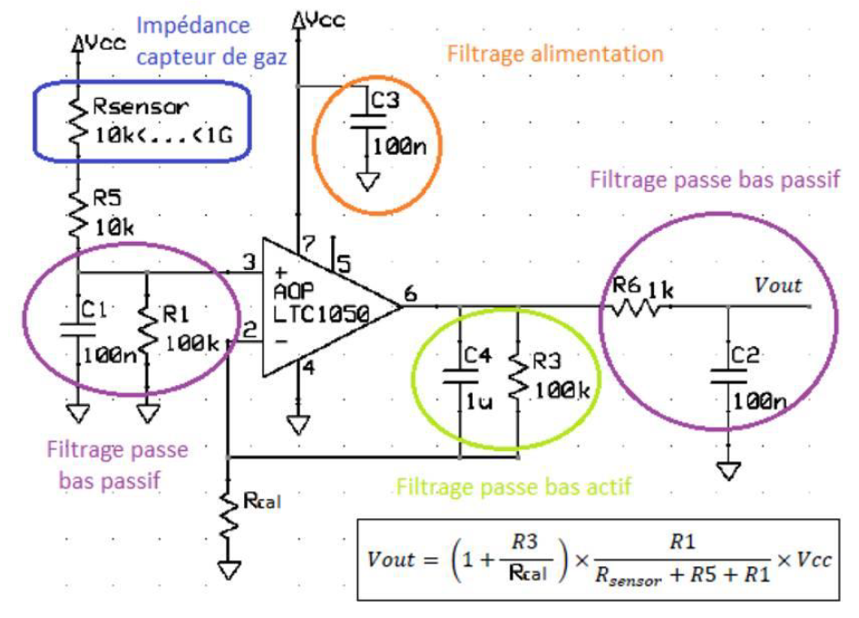
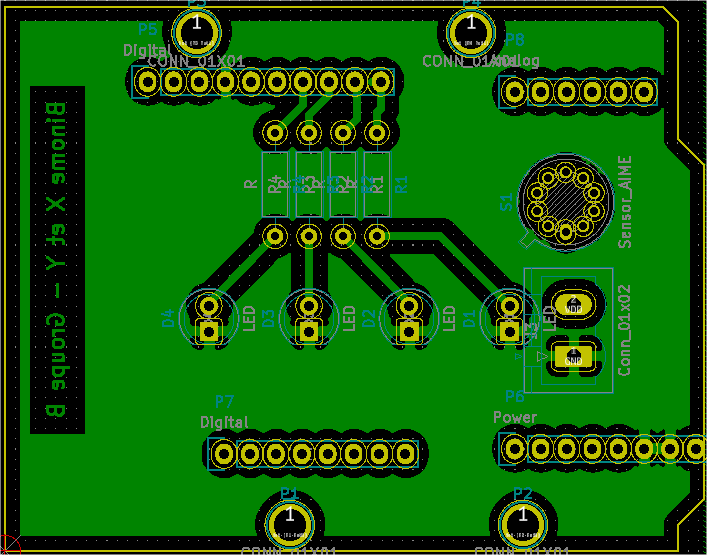

# My Trainning

My first project with KiCad...

<!-- Syntaxe Markdown: https://learnxinyminutes.com/docs/fr-fr/markdown-fr/ -->

## Here is my schema



## Here is my Arduino shield for my gas sensor

<!-- You can also add images with simple HTML tags: -->

<p align="center">
  
</p>

## And a part of importante code

```c
/* on Arduino Uno */
#define OFF 0
#define ON 1
#define T_REGENERATION_MS 2500 // 2.5 sec for regeneration delay
...
    // somewhere in the state machine
    if ( isRgazSensorSaturated() ) {
        // if the gas sensor saturated do
        setRregeneration(ON);
        delay(T_REGENERATION_MS) // wait for the necessary time, see https://www.arduino.cc/reference/en/#functions
        setRregeneration(OFF);
    }
...

```

## MIT license


